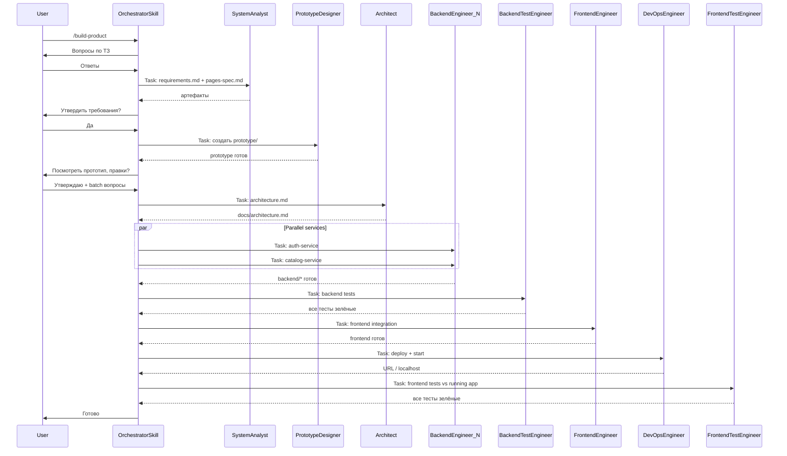

# Decomposition Pattern — AI Product Factory

Мультиагентный фреймворк для **30+ AI-сред** (тот же список, что у OpenSpec): от ТЗ заказчика до протестированного и развёрнутого продукта с микросервисной архитектурой.

**Запуск:** `/build-product` в вашей IDE (Cursor, Claude Code, Windsurf, Copilot и др.)

---

## Quick start

### Требования

- Любая AI-среда из [списка OpenSpec](platforms/registry.json) (Cursor, Claude Code, Windsurf, …)
- Node.js 20+
- Docker и Docker Compose (для фазы deploy)
- OpenSpec (рекомендуется): `npm install -g @fission-ai/openspec`

### Запуск с нуля

```bash
# 1. Клонировать шаблон
git clone https://github.com/YOUR_ORG/decomposition-pattern.git my-product
cd my-product

# 2. (Опционально) OpenSpec CLI
npm install -g @fission-ai/openspec

# 3. Настроить одну AI-среду — в корне появится только её папка (.cursor/, .claude/, …)
npm run setup -- --tool cursor --clean

# Альтернативы:
# npm run setup -- --detect --clean    # угадать среду по окружению
# npm run setup                          # интерактивный выбор
# npm run setup -- --tool claude --skip-openspec   # без openspec init
```

**Что делает `npm run setup`:**

| Шаг | Действие |
|-----|----------|
| `--clean` | Удаляет папки других платформ (`.claude/`, `.windsurf/`, …) |
| OpenSpec | `openspec init --tools <id>` (если CLI установлен) |
| Skill | Генерирует `{skillsDir}/build-product/SKILL.md` для выбранной среды |
| Runtime | Пишет `.project/runtime.json` — оркестратор знает режим делегирования |

Список ID: `npm run setup -- --list`

### npm-скрипты

| Команда | Описание |
|---------|----------|
| `npm run setup` | Интерактивный выбор платформы |
| `npm run setup -- --tool cursor --clean` | Настройка Cursor, удаление остальных platform-папок |
| `npm run setup -- --detect --clean` | Автоопределение среды по окружению |
| `npm run init:platforms -- --tools cursor` | Только перегенерация `SKILL.md` (без OpenSpec и runtime) |

Для GitHub Copilot skill создаётся в `.github/skills/` — при `--clean` удаляется только эта подпапка, не `.github/workflows/`.

### Первый запуск

1. Откройте папку проекта в выбранной IDE (например, Cursor).
2. В чате агента:

```
/build-product Веб-приложение на основе MSA
```

Или с явной платформой: `/build-product --platform claude`

Оркестратор проведёт через 14 фаз: сбор требований → прототип → архитектура → backend → тесты → frontend → deploy → frontend e2e.

### Смена AI-среды

```bash
npm run setup -- --tool windsurf --clean
```

Переключит skill, runtime и (при наличии OpenSpec) конфиг — остальные platform-папки будут удалены.

### Что получится на выходе

После прохождения всех 14 фаз `/build-product` создаёт полноценный проект: React frontend, N микросервисов с отдельными БД, API Gateway, docker-compose, автотесты backend и frontend e2e. Конкретный набор сервисов определяется вашим ТЗ — типичное MSA-приложение может включать auth, catalog, orders, notifications и analytics.

---

## Поддерживаемые AI-среды

Тот же список, что при `openspec init --tools` ([platforms/registry.json](platforms/registry.json)):

| ID | Среда | Делегирование |
|----|-------|---------------|
| `amazon-q` | Amazon Q Developer | slash-command |
| `antigravity` | Antigravity | slash-command |
| `auggie` | Auggie | slash-command |
| `bob` | IBM Bob Shell | slash-command |
| `claude` | Claude Code | subagent |
| `cline` | Cline | subagent |
| `codex` | Codex | slash-command |
| `forgecode` | ForgeCode | skill-only |
| `codebuddy` | CodeBuddy | slash-command |
| `continue` | Continue | slash-command |
| `costrict` | CoStrict | slash-command |
| `crush` | Crush | slash-command |
| `cursor` | Cursor | task-tool |
| `factory` | Factory Droid | slash-command |
| `gemini` | Gemini CLI | slash-command |
| `github-copilot` | GitHub Copilot | slash-command |
| `iflow` | iFlow | slash-command |
| `junie` | Junie | slash-command |
| `kilocode` | Kilo Code | subagent |
| `kimi` | Kimi CLI | skill-only |
| `kiro` | Kiro | slash-command |
| `lingma` | Lingma | slash-command |
| `opencode` | OpenCode | slash-command |
| `pi` | Pi | slash-command |
| `qoder` | Qoder | slash-command |
| `qwen` | Qwen Code | slash-command |
| `roocode` | RooCode | subagent |
| `trae` | Trae | skill-only |
| `vibe` | Mistral Vibe | skill-only |
| `windsurf` | Windsurf | subagent |

Skill для выбранной среды: `{skillsDir}/build-product/SKILL.md` (генерируется `npm run setup`).

Подробнее: [platforms/README.md](platforms/README.md)

---

## Архитектура пайплайна

```mermaid
flowchart LR
    subgraph phase1 [Фаза 1: Продукт]
        TZ[ТЗ и аналитика]
        Pages[Страницы и функционал]
        Proto[Прототип Vite+React]
        Review[Правки прототипа]
    end

    subgraph phase2 [Фаза 2: Архитектура]
        Stack[Выбор стека]
        DB[Схема БД и DDD]
        API[OpenAPI по сервисам]
        Gateway[API Gateway spec]
    end

    subgraph phase3 [Фаза 3: Реализация]
        MS[Параллельные микросервисы]
        BTests[Backend автотесты]
        Compose[docker-compose]
        FE[Frontend engineer]
        Deploy[Запуск локально или сервер]
        FTests[Frontend автотесты]
    end

    TZ --> Pages --> Proto --> Review
    Review --> Stack --> DB --> API --> Gateway
    Gateway --> MS --> BTests --> Compose --> FE --> Deploy --> FTests
```



---

## Оркестрация в Cursor



**Правило:** только оркестратор общается с пользователем. Subagent'ы делегируются по режиму из `.project/runtime.json` (см. [platforms/delegation/](platforms/delegation/)).

---

## Карта агентов

| # | Агент | Роль |
|---|-------|------|
| 00 | Orchestrator | Координация, gates, единственный канал к пользователю |
| 01 | System Analyst | Сбор ТЗ, `requirements.md`, `pages-spec.md` |
| 02 | Tech Advisor | Варианты стека, `tech-stack.md` |
| 03 | Prototype Designer | Vite+React+Tailwind прототип с mock-данными |
| 04 | Prototype Reviewer | Правки прототипа по feedback |
| 05 | Architect | DDD, `docs/architecture.md` |
| 06 | API Designer | OpenAPI + db.md per service, API Gateway |
| 07 | Backend Engineer | Микросервисы в `backend/{service}/` |
| 08 | Backend Test Engineer | Vitest per service, цикл до green |
| 09 | DevOps Engineer | docker-compose, SSH deploy, health checks |
| 10 | Frontend Engineer | `prototype/` → `frontend/`, API client, JWT |
| 11 | Frontend Test Engineer | Тесты после запуска, Playwright e2e |

Детали: [AGENTS.md](AGENTS.md) и файлы в [`.agents/`](.agents/).

---

## Фазы и gate'ы

| Фаза | Агент | Gate |
|------|-------|------|
| 0. Bootstrap | Orchestrator | — |
| 1. Discovery | System Analyst | `requirements.md` утверждён |
| 2. Tech Stack | Tech Advisor | `tech-stack.md` утверждён |
| 3. IA / Pages | System Analyst | `pages-spec.md` утверждён |
| 4. Prototype | Prototype Designer | `npm run dev` работает |
| 5. Prototype Review | Prototype Reviewer | «Прототип утверждён» |
| 6. Batch approvals | Orchestrator | deploy, SSH, CI зафиксированы |
| 7. Architecture | Architect | архитектура утверждена |
| 8. API Design | API Designer | спеки утверждены |
| 9. Gateway | API Designer | `docs/api-gateway.yaml` |
| 10. Backend | Backend Engineer × N | все сервисы + compose |
| 11. Backend Tests | Backend Test Engineer | все backend-тесты green |
| 12. Frontend | Frontend Engineer | FE работает с backend |
| 13. Deploy / Start | DevOps Engineer | система доступна |
| 14. Frontend Tests | Frontend Test Engineer | все frontend-тесты green |

Состояние хранится в `.project/state.json` (схема: [templates/project-state.schema.json](templates/project-state.schema.json)).

---

## OpenSpec

OpenSpec — слой живых требований. Агенты читают и пишут артефакты; OpenSpec их версионирует.

| Задача | OpenSpec |
|--------|----------|
| Системный анализ | `proposal.md` + `specs/` |
| Утверждение перед кодом | Review до `/opsx:apply` |
| Микросервисы | Delta-specs per bounded context |
| Параллельная реализация | Task groups в `tasks.md` |
| Архивация | `/opsx:archive` → `openspec/specs/` |

### Инициализация

OpenSpec инициализируется при `npm run setup` (если CLI установлен). При первом `/build-product` оркестратор также может выполнить:

```bash
openspec init   # если openspec/ ещё нет
```

### Команды (в Cursor)

| Команда | Назначение |
|---------|------------|
| `/opsx:propose` | Создать change с proposal, specs, design, tasks |
| `/opsx:apply` | Реализовать tasks из change |
| `/opsx:archive` | Архивировать завершённый change |

Шаблон change: [openspec/changes/_template/](openspec/changes/_template/).

**Fallback:** без OpenSpec — `docs/requirements.md` + `docs/tasks.md`.

---

## Структура репозитория фреймворка

```
decomposition-pattern/
├── README.md
├── AGENTS.md
├── package.json              ← npm run setup
├── build-product/            ← ядро оркестратора (platform-agnostic)
├── platforms/                ← registry.json + delegation modes
├── scripts/
│   ├── setup.mjs             ← одна платформа + runtime.json
│   └── generate-platform-skills.mjs
├── .cursor/skills/           ← только после setup --tool cursor
├── .project/runtime.json     ← активная платформа
├── .agents/
├── templates/
├── playbooks/
└── openspec/
```

Сгенерированные папки платформ (`.cursor/`, `.claude/`, …) в `.gitignore` — каждый разработчик запускает `npm run setup` локально.

---

## Структура генерируемого проекта

После прохождения всех фаз `/build-product` создаёт:

```
my-product/
├── .project/
│   ├── state.json
│   └── deploy.json           # SSH/host (не коммитить ключи)
├── .ssh/                     # SSH-ключи (в .gitignore)
├── docs/
│   ├── requirements.md
│   ├── pages-spec.md
│   ├── tech-stack.md
│   ├── architecture.md
│   ├── api-gateway.yaml
│   └── {service}/
│       ├── api.yaml
│       └── db.md
├── prototype/                # на этапе прототипа
├── frontend/                 # после интеграции
│   └── tests/
├── backend/
│   ├── docker-compose.yaml
│   ├── api-gateway/
│   └── {service}/
└── openspec/changes/         # если OpenSpec включён
```

---

## Стек по умолчанию

| Слой | Default | Альтернатива |
|------|---------|--------------|
| Frontend | React + Vite + TS + Tailwind | Next.js |
| Backend | Node.js + Express + TS | Fastify / NestJS |
| DB | PostgreSQL per service | — |
| Auth | JWT | OAuth2 |
| Backend tests | Vitest + supertest | — |
| Frontend tests | Vitest + Testing Library + Playwright | Cypress |
| Deploy | Docker Compose | K8s |
| Events | In-process / optional RabbitMQ | Redis streams |

---

## Деплой и SSH

1. После утверждения прототипа оркестратор спрашивает: **локально или удалённый сервер?**
2. Для сервера: положите ключ в `.ssh/` проекта, укажите host в `.project/deploy.json`
3. DevOps agent: `docker compose up -d` (локально) или SSH + compose (удалённо)
4. Health check всех `/health` endpoints + frontend доступен
5. Frontend Test Engineer получает `baseUrl` для Playwright

Подробнее: [playbooks/06-deploy.md](playbooks/06-deploy.md).

**Безопасность:** `.ssh/` в `.gitignore` — ключи никогда не коммитятся.

---

## Playbooks

| Playbook | Фаза |
|----------|------|
| [01-discovery.md](playbooks/01-discovery.md) | ТЗ, системный анализ |
| [02-prototype.md](playbooks/02-prototype.md) | Прототип Vite+React |
| [03-architecture.md](playbooks/03-architecture.md) | DDD, микросервисы |
| [04-backend.md](playbooks/04-backend.md) | Параллельная реализация backend |
| [05-integration.md](playbooks/05-integration.md) | Frontend + API |
| [06-deploy.md](playbooks/06-deploy.md) | Docker, SSH |
| [07-frontend-testing.md](playbooks/07-frontend-testing.md) | Playwright e2e |

---

## Ограничения и риски

- **Task tool** не гарантирует полную изоляцию subagent'ов — контракты в `.agents/` должны быть строгими
- **OpenSpec** — опциональная npm-зависимость; есть fallback на markdown
- **Параллельные сервисы** — max 4 concurrent Task
- **Frontend e2e** — только после подтверждённого health check DevOps agent'ом
- **SSH deploy** — только с явного разрешения пользователя
- **Цикл исправлений тестов** — max 3 итерации per phase, затем эскалация пользователю

---

## Лицензия

MIT
