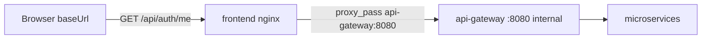

# Playbook 06: Deploy

**Agent:** 09-devops-engineer  
**Output:** running stack, `docs/deploy-log.md`, `state.baseUrl`

## Prerequisites

- `.project/deploy.json` filled during batch approvals
- `.ssh/` key present if remote (never commit)

## Production ports

| Endpoint | Role |
|----------|------|
| `state.baseUrl` (e.g. `http://host:8880`) | **Public SPA origin** — browser + API smoke target |
| `{baseUrl}/api/*` | Proxied by frontend nginx → `api-gateway:8080` (Docker network) |
| Host `:8080` | Optional direct gateway access for debug — **not** `baseUrl`, not what SPA uses |



## Local deploy

```bash
cd backend && docker compose up -d --build
# wait for health
curl -sf http://localhost:8080/health

cd frontend && npm install && npm run dev
# baseUrl = http://localhost:5173
# API smoke via Vite proxy: curl -sf http://localhost:5173/api/... (or gateway :8080 for debug only)
```

## Remote deploy

Copy and adapt `templates/scripts/deploy-remote.sh` → `scripts/deploy-remote.sh` in the **generated project** (not framework root):

```bash
cp templates/scripts/deploy-remote.sh scripts/deploy-remote.sh
# edit if needed, then:
./scripts/deploy-remote.sh
```

Or manual rsync:

```bash
rsync -avz --exclude node_modules --exclude .git \
  -e "ssh -i .ssh/{key}" \
  ./ user@host:/path/to/app/

ssh -i .ssh/{key} user@host << 'EOF'
  cd /path/to/app/backend
  docker compose pull
  docker compose up -d --build
EOF
```

## Post-deploy smoke (mandatory)

Run via `templates/scripts/post-deploy-smoke.sh` or equivalent curls. **All checks use `state.baseUrl`** — same origin as the browser.

```bash
BASE="http://host:8880"   # from state.baseUrl — include port if non-80

curl -sf "$BASE/health"                    # 200
curl -sf -o /dev/null -w "%{http_code}" "$BASE/api/auth/me"   # expect 401, NOT 404
curl -sf -o /dev/null -w "%{http_code}" "$BASE/api/{service-resource}"  # 401 without token
```

**Do not** mark deploy complete if any `/api/*` returns 404 — fix nginx proxy or gateway routing first.

Optional: POST register/login → 201/200 with valid credentials.

Record results in `docs/deploy-log.md`.

## Health checks

Every backend service must respond:

```
GET /health → 200 { "status": "ok" }
```

Gateway (internal/debug):

```
GET http://localhost:8080/health
```

## Frontend production

Use `templates/frontend/nginx.conf` in frontend Docker image. Typical compose mapping: `8880:80`.

```bash
cd frontend && npm run build
# nginx serves dist/ + proxies /api/ to api-gateway:8080
```

## deploy-log.md template

```markdown
# Deploy Log

- Date:
- Target: local | remote
- baseUrl: (full URL with port, e.g. http://89.223.121.80:8880)
- SPA /health: OK | FAIL
- API smoke via baseUrl (/api/* → 401 not 404): OK | FAIL
- Backend internal health: OK | FAIL
- Commands run: ...
- Issues: ...
```

## Handoff to Frontend Test Engineer

Set `state.baseUrl` only after **API smoke via baseUrl** passes (not 404 on `/api/*`).
