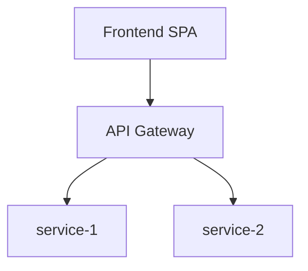

# Architecture — {{PROJECT_NAME}}

**СУБД:** PostgreSQL 15+ (отдельная база на каждый сервис)  
**Соглашения:** `snake_case`, UUID PK, `created_at` / `updated_at`

Источник требований: `docs/requirements.md`, `docs/pages-spec.md`, `prototype/`

---

## Принципы декомпозиции (DDD)

| Принцип | Реализация |
|---------|------------|
| Bounded Context | Один микросервис = один контекст |
| Database per Service | Отдельная PostgreSQL-база; кросс-сервисные FK запрещены |
| Aggregate | Транзакционная граница внутри сервиса |
| Domain Events | Асинхронная синхронизация read-моделей |

---

## Карта микросервисов

---

## Сводная таблица сервисов

| Сервис | Bounded Context | База данных | Агрегаты | Страницы |
|--------|-----------------|-------------|----------|----------|
| `example-service` | Example | `app_example` | `Example` | `/example` |

---

## Доменные события

| Событие | Издатель | Подписчики |
|---------|----------|------------|
| `ExampleCreated` | example-service | analytics-service |
